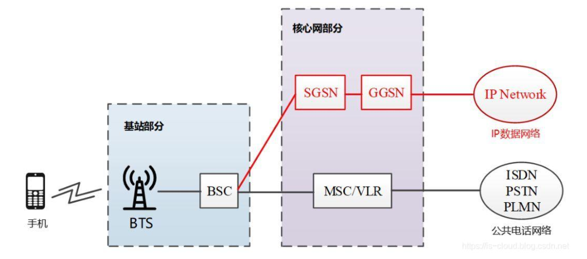
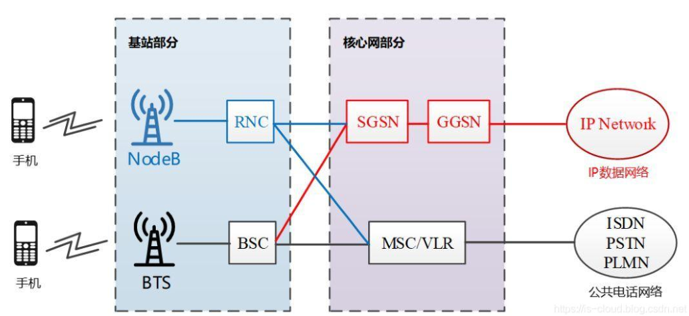

[TOC]

## 第二章-现代无线通信系统

## 无线蜂窝系统

### 1G——语音

- 模拟通信技术——“**模拟蜂窝**移动通信系统”
- 典型频段：**800–900 MHz**
- 典型速率——**2.4kbps**
- 调制方式：FM
- 多址技术：采用FDMA/FDD技术

| 典型系统 | 频段                                    | 数据速率 | 信道带宽              | 特点                         |
| -------- | --------------------------------------- | -------- | --------------------- | ---------------------------- |
| AMPS     | 上行：824–849 MHz 下行：869–894 MHz | 2.4kbps  | 30 kHz 信道数832 | 全双工FDD，上下行信道差45MHz |

### 2G——语音文本

- 数字通信技术——称为“**数字蜂窝**移动通信系统”

- 典型频段：**900 MHz**、**1.8 GHz**（欧洲DCS1800）、**1.9 GHz**（北美PCS）

- 典型速率——8kbps、9.6kbps、64kbps

- 多址技术：TDMA（时分多址）+ FDMA（频分多址）/码分多址（CDMA）

  | 典型系统             | 频段                                        | 数据速率  | 信道带宽                                          | 特点                         |
  | -------------------- | ------------------------------------------- | --------- | ------------------------------------------------- | ---------------------------- |
  | GSM （GSM-900） | 890–915 MHz（上行） 935–960 MHz（下行） | 9.6kbps   | 200 kHz （每信道支持8个用户） 信道数124 | 全双工FDD，上下行信道差45MHz |
  | CDMA（IS-95）        | 800 MHz频段                                 | 14.4 kbps | 所有用户共享同一1.25 MHz带宽                      | 略                           |
  
- 技术演进(2G-->3G)：

  - CSD（电路交换）-->GPRS（无线分组交换）

    - GPRS技术还支持IP协议，标志着无线通信系统**首次支持互联网服务**

      红色部分为GPRS技术为无线通信网络接入的IP数据网络，在此之前无线终端只接入电话网络

      

    - 话音业务转数据业务，按流量计费

  - 调制技术演进提高数据速率：数据速率9.6 kbps（CSD）到**384 kbps**（EDGE）

### 3G——多媒体服务

- 移动互联网、多媒体业务

- 典型频段：**2.1 GHz**、**850/1900 MHz**

- 典型速率：384kbps

- 多址技术：**CDMA——3G标志**

- 典型系统

  | 典型系统 | 数据速率 | 特点 |
  | -------- | -------- | ---- |
  | TD-SCDMA | 2k-2Mbps | TDD  |
  | CDMA2000 | 384kbps  | FDD  |
  | WCDMA    | 384kbps  | FDD  |

- 网络架构革新：全面支持数据业务，接入互联网

  - IP化，大量使用光纤
  - 用户面(数据)和控制面分离:RNC（无线网络控制器,负责移动性管理、呼叫处理、链路管理和移交机制

  

- 技术演进：

  - HSDPA：W-CDMA技术的延伸，分组数据业务，下行链路5MHz载波上8-10Mbps
  - HSUPA：上传速度大5.76Mbps

### 4G——移动互联网

- 全球逐渐统一——LTE
- 典型速率：100-200Mbps的下载速率和75Mbps的上传速率
- 典型频段：懒得记了
- 典型系统：ppt没

### 5G——数据、连接、用户体验

- 典型应用场景：增强移动宽带、超可靠低延迟通信、海量机器通信

## 无线局域网

- 典型频段：2.4GHz、5.8GHz（ISM频段）

- 覆盖范围：

  - 蓝牙个域网WPAN

  见第一章笔记

