[TOC]

# 第四章—大尺度衰落和路径损耗

## 基础知识（带过即可）

- dB dBm——相对1W或1mW功率

- 放大与衰减

- 各方向具有相同单位增益的理想全向天线——**参考天线**

- **半波长偶极子天线**：

  - 相比较理想全向天线，半波长偶极子天线具有1.64的增益
    （**2.15dB**）

- EIRP——等效全向辐射功率——用于衡量实际无线系统在**最大方向**的辐射强度
  $$
  EIRP=P_tG_t=P_t\left[ dBm \right] +G_t\left[ dB \right]
  $$

  $$
  \text{即：如果使用理想全向天线，想要在此方向（原天线的最大方向，天线很可能不是全向的，可能能量聚集到一个方向）}
  $$
  $$
  \text{获得相同功率，需要输入的功率}
  $$

- ERP——等效发射功率——将EIRP中的等效全向天线替换为半波偶极子天线
  $$
  EPR=EIRP-2.15
  $$

## 无线电传播基本模型（移动通信基本模型/脉络）

**传输模型**：

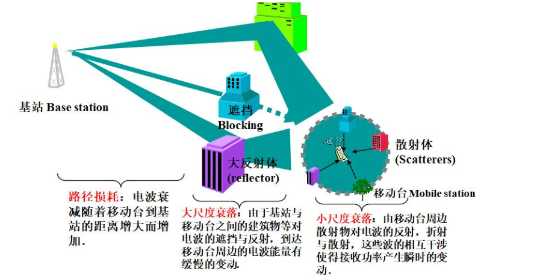

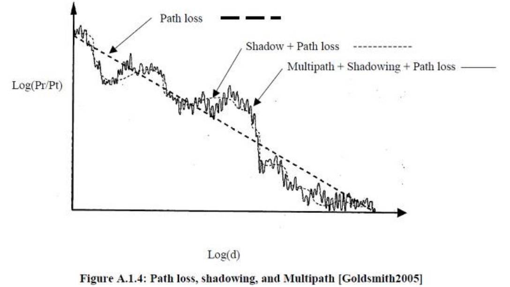

接收功率：
$$
P_r\left[ dBm \right] =P_t\left[ dBm \right] +PL\left[ dB \right] +shadowing\left[ dB \right] +MTP\left[ dB \right]
$$

- 大尺度
  - 路径损耗PL——均值
  - 阴影效应shadowing：高斯随机变量
- 小尺度
  - 多径效应MTP

## 自由空间传播模型（重点）

### Friis公式——（自由空间理想情况）

$$
P_r=\frac{P_tG_tG_r\lambda ^2}{\left( 4\pi \right) ^2d^2}
$$

$$
P_r\left[ dBm \right] =P_t\left[ dBm \right] +G_t\left[ dB \right] +G_r\left[ dB \right] +20\lg \left[ \lambda \right] -20\lg \left[ 4\pi \right] -20\lg \left[ d \right]
$$

需满足远场条件：

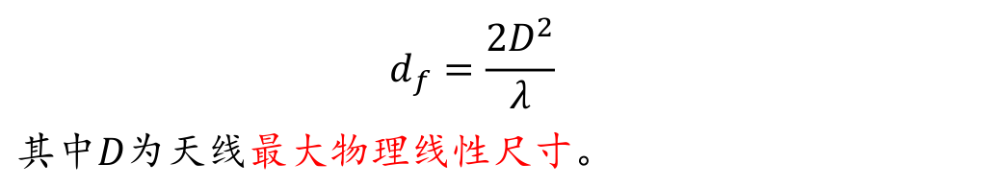
$$
可同时满足远场距离df>>D且df>>\lambda
$$

### 一般情况下的路径损耗模型（Friis公式变形）

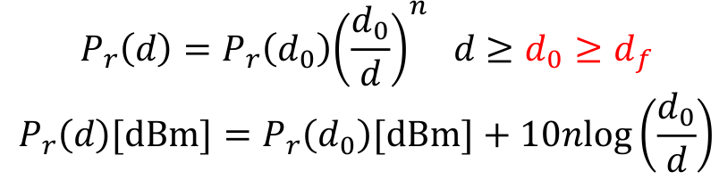

- 路径损耗指数n：受环境影响

  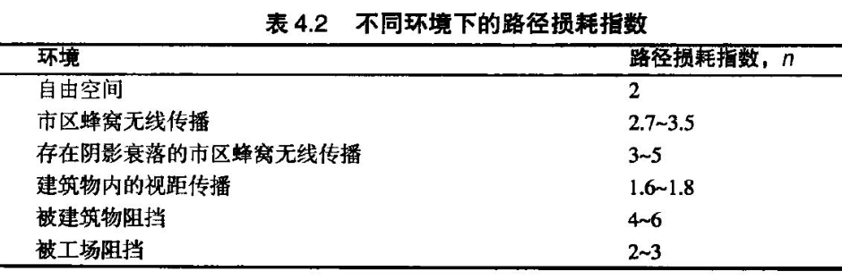

## 三种基本传播机制

- 反射
- 绕射
- 散射

1. 双线模型——地面反射

   1. 条件：天线高度超过50m

   2. d范围要远大于天线高度和

   3. 可预测几千米范围内

   4. 模型

      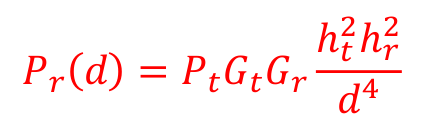

   5. 路径损耗因子为4，衰减远远快于自由空间

   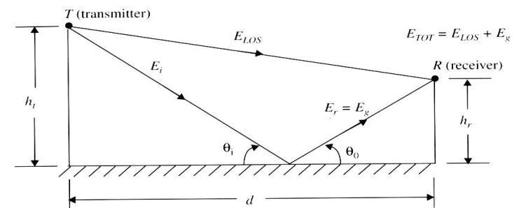

2. 断点模型——自由空间传播+地面反射
   $$
   \left\{ \begin{array}{l}
   	P_r\left( d \right) =P_r\left( d_0 \right) \left( \frac{d_0}{d} \right) ^2,d_0<d<d_{break}\\
   	P_r\left( d \right) =P_r\left( d_{break} \right) \left( \frac{d_0}{d} \right) ^n,3.5<n<4.5,d>d_{break}\\
   \end{array} \right.
   $$

3. 绕射

   1. 菲涅尔区

      - 示意图

        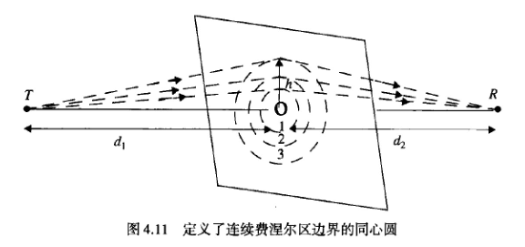

      - 第n个同心圆半径

        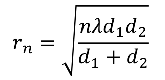

      - **直射路径与第n个菲涅尔区的绕射路径的差值为n个半波长**

      - 当障碍物不阻挡第一费涅尔区（40%以内）时，绕射损失可以忽略不计——第一菲涅尔区内集中最多的能量

   2. 菲涅尔绕射参数

      - 公式

        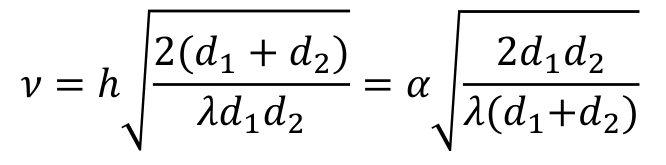

      - 与直射绕射路程差的关系

        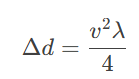

        则可以通过计算菲涅尔绕射参数间接得知障碍物遮挡了T-R间的第n菲涅尔区——**直射路径与第n个菲涅尔区的绕射路径的差值为n个半波长**

        所以有：
        $$
        n\approx \frac{v^2}{2}
        $$

4. 散射？

   1. 在实际的移动通信环境中，接收信号强度比单独绕射和反射模型预测的**要强**

## 常见室外传播模型（A4记忆）

### Okumura模型

- 完全基于测量数据，不提供理论解释

- 用于**城市信号**强度预测

- 数学模型

  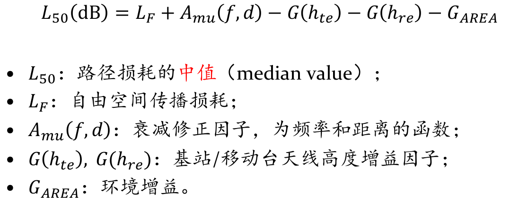

  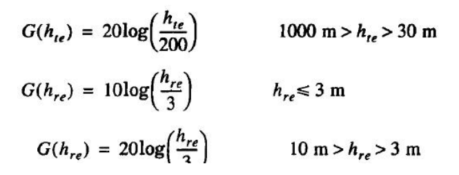

### Hata模型

- Hata模型是根据Okumura曲线图所做的**经验公式**

- 数学模型

  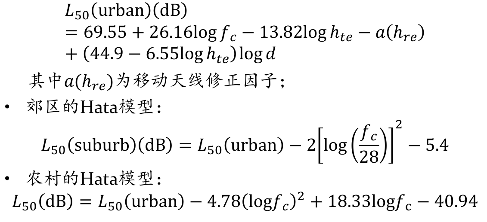

## 对数阴影效应

- 阴影效应：在传播**距离相同**的情况下，接收功率由于障碍物遮挡导致的接收功率呈**对数正态随机分布**的现象

- 模型：
  $$
  \widetilde{PL}\left[ dB \right] =PL\left[ dB \right] +X_{\sigma}\left[ dB \right]
  $$

  $$
  \text{其中，}PL\left[ dB \right] \text{为路径损耗均值}PL\left( d_0 \right) +10n\log \left( \frac{d}{d_0} \right) \text{，}
  $$
  $$
  X_{\sigma}\left[ dB \right] =10\lg X\sim N\left( 0,\sigma ^2_{X_{\sigma}\left[ dB \right]} \right)
  $$

  $$
  n\text{、}\sigma \text{基于实测拟合}
  $$

- **中断率**

  - 仅考虑阴影效应这一随机变量，不考虑多径效应

  - Q函数：标准正态函数的右尾函数

    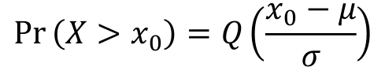

    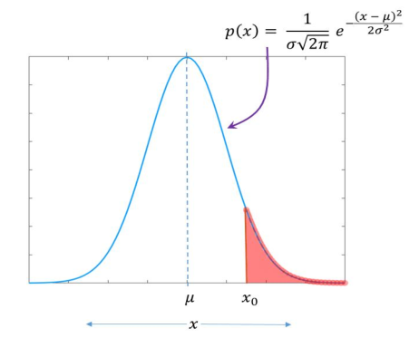

  - 中断率和可靠性

    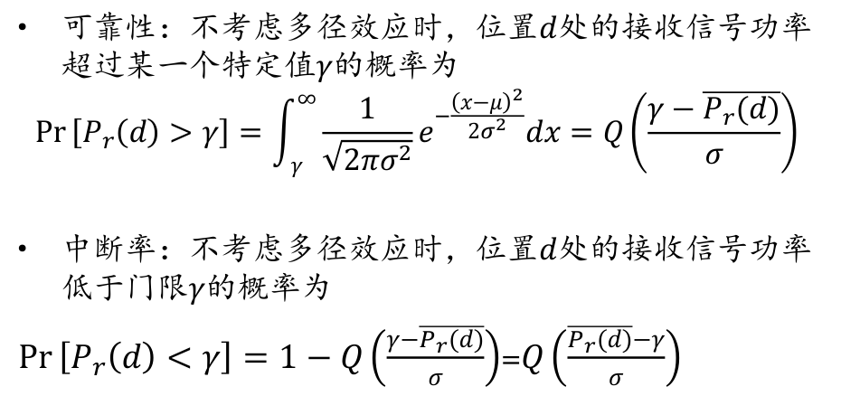

  - 中断率的等价关系：
    $$
    \text{接收功率}P_r\text{低于接收门限值}\gamma \Longleftrightarrow \text{路径损耗}PL\text{高于衰落门限值}\gamma'\left( \text{发射端不变} \right)
    $$

    $$
    \text{可靠性95\%}\Longleftrightarrow \text{中断率5\%}
    $$

  - 衰落余量：接受门限高于接受功率均值的冗余部分，用于提高系统可靠性

- 覆盖面积的百分率

  - 覆盖区域有效服务区域的占比$U(\gamma)$——是$\gamma$的函数，即接收信号高于门限值的区域占比

  - 公式

    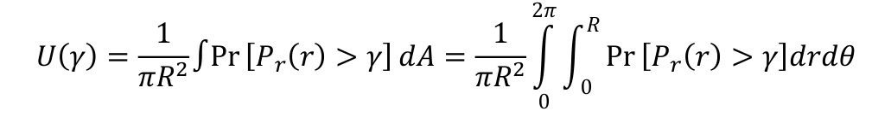

    其中dA为面积微元rdrdθ

    结合Pr的具体公式：...

  - 图像

    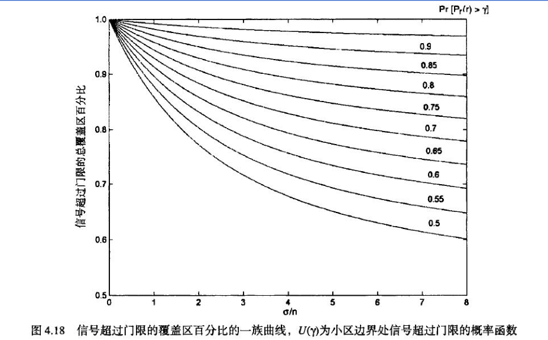

    随机性(σ/n)越强，则覆盖的中断率越高。

  - 小区中断率：1-U（γ）——表示小区的中断面积占比

## 噪声相关参数计算

### 噪声功率

- 噪声分类

  - **热噪声**——器件电子的热运动导致的噪声，通常是高斯白噪声
  - 闪烁噪声
  - 相位噪声

- **热噪声功率计算**
  $$
  P_n=N_0B
  $$

  $$
  N_0=kT_0\text{，其中}k=1.38\times 10^{-23}J/K\text{，}T_0\text{为噪声温度，取}290K
  $$

  $$
  \text{所以，}N_0\text{为一相对确定常数，用对数形式表达常温下的噪声功率有}
  $$

  $$
  P_n\left[ dBm \right] =-174+10\lg B[dBm]
  $$

### 噪声系数

- 噪声系数：器件的输入/输出信噪比的比值，事实上噪声系数只针对噪声功率而言，与信号功率无关

  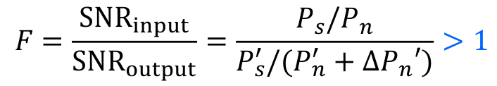

- 模型：器件输入端在输入信号基础上引入了热噪声

  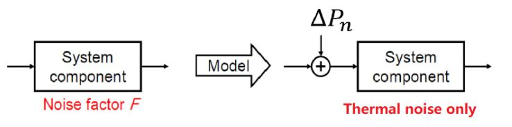

  假定器件增益为G则有

  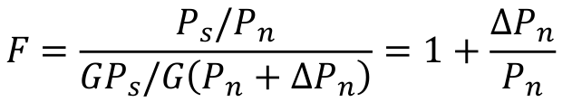

  **接收机只能恶化SNR**

- 等效噪声温度Te

  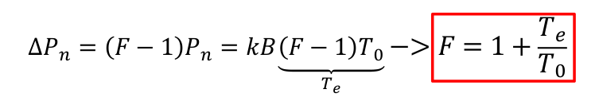

  等效噪声温度表示，器件（系统）输入端**引入的额外噪声功率对应的温度**（热噪声功率和开氏温度成正比），则利用等效噪声温度，可以用噪声系数计算输入端等效噪声功率Pn
  $$
  P_n=P_{n0}F=kT_0B\left( 1+\frac{T_e}{T_0} \right) =k\left( T_0+T_e \right) B
  $$
  这样做的好处是可以忽略接收机中，各级电路引入的额外噪声，直接利用噪声系数/或等效的噪声温度，就可以计算等效输入噪声功率（此处的等效意思是，综合考虑了系统的各级噪声系数和增益，输入信号功率/等效输入噪声功率 = 输出信噪比）

  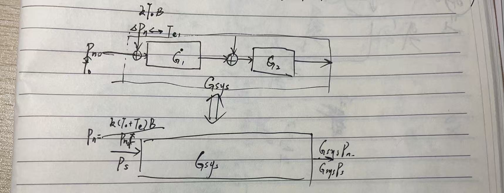

- 对于**负性负载**（衰减器/传输线），**器件损耗等于器件的噪声系数**
  $$
  F\left[ dB \right] =L\left[ dB \right]
  $$
  定性理解：负性负载的信号功率下降，但噪声功率仍保持不变，则器件损耗L（10lg(Pin/Pout)）等于噪声系数

- **负性**元件组成的**天线**可以视为**单位增益0dB**

- 级联系统的噪声系数

  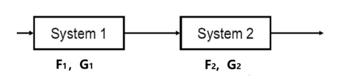

  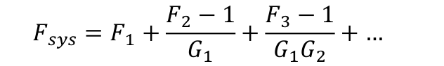

  级联系统的噪声系数主要由第一级决定
  
  注意公式中均为线性值
  
  
