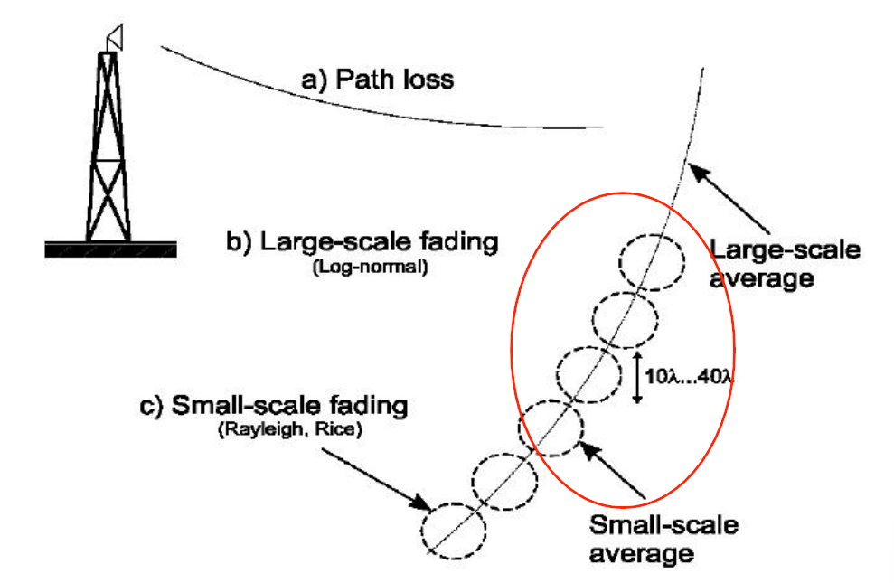
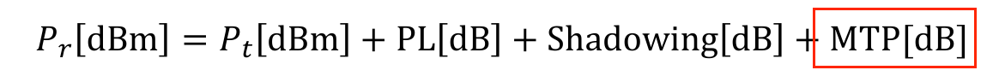
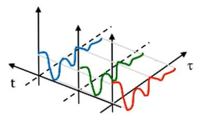
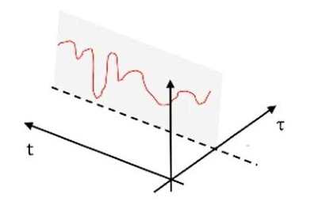
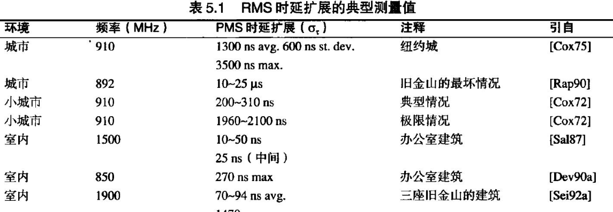
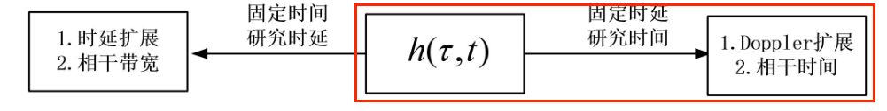

[TOC]

# 第五章-小尺度衰落和多径效应

## 小尺度衰落模型

## 小尺度衰落的因素

### 多径效应

- 原因及表现：信号通过不同的方向和路径传输，会经历不同的**时延**、**衰减**、**相移**（时延和反射相位损失等），导致**不同多径分量**的幅度、相位**时变随机**分布。

  所有多径分量**合成**后成为了接收信号，固定时间（相干时间内或静态信道）不同时延导致了接收信号时间上的色散（码间串扰——相关带宽）；

  

  固定时延（单径信道）的时变信道，则导致接收信号的频率色散（多普勒频移频谱展宽，在时域上表现为相干时间）

  

- 模型：时变冲激响应belike

  

  - 其中n=0为LOS(视距/直达径)，其他为多径分量
  - 冲激函数——时变传播时延，不同多径的T-R距离时变
  - 幅度增益——时变多径信道增益，不同多径信道的障碍物、反射、绕射、T-R距离等时变因素
  - 相位旋转——时变多径相位旋转，信道的多普勒偏移和传播延迟共同决定

- –时变特性：收发信机、环境的空间运动；
- –滤波特性：以任一时刻 t 到达的多径信号为基础，其幅度和时延联合影响信道的滤波特性——相关带宽。

### 多普勒效应

## 小尺度衰落的参数

### 时延拓展与相关带宽

- 定性分析：

  无线通信需要将速率为$R_B$的基带信号调制到带通载波上，那么假如因为多径效应造成的时延拓展$\sigma_\tau$超出了码元周期$T_s$，就会造成严重的码间串扰，这就需要时域均衡器来减小码间串扰。

  换个角度思考，时延拓展的倒数就是表示：在一定频率间隔内的不同频率分量有很强的幅度相关性（频域上表明信道对与所有信号频率分量来说都是平坦的；时域上表明码间串扰小，不同分量合成时，基带信号都是同一个码元），这也就定义了相关带宽，表明在这个频率间隔内的话，不同的频率分量有相近的增益（频率一致性）。当然，相关带宽正好与基带信号带宽相近也会带来很大码间串扰（时延与码元周期相近），所以在定义相关带宽时，根据需要的频率相关性调整相关带宽

- 定量分析

  - **rms时延拓展$\sigma_{\tau}$**
    $$
    \sigma _{\tau}=\sqrt{\bar{\tau^{2}}-\bar{\tau}^2}
    $$
    为什么不用平均时延$\bar{\tau}$？

    ​	因为信号都是以同一个时延到达的话，就是说接收信号没有时间上的弥散，也就没有码间串扰，要产生码间串扰就应该考虑的是“时延的最大差值”——所以用时延的标准差来考量非常合理。
    
    时延拓展典型值：室内ns级，室外ms级
    
    
    
  - **相关带宽Bc**
  
    根据不同的频率相关性要求，选择合适的相关带宽
    $$
    B_c=\left\{ \begin{array}{l}
    	\frac{1}{5\sigma _{\tau}}\ \text{，}\rho >0.9\\
    	\frac{1}{50\sigma _{\tau}},\ \rho >0.5\\
    \end{array} \right.
    $$

### 多普勒拓展与相关时间

- 定性分析：同样考虑基带信号的稳定传输，要求信号在一个码元周期内增益稳定（不能有剧烈衰落，当然也不能因为时延拓展产生明显的码间串扰），当考虑信号的时变增益在一个码元周期内稳定时（此时固定各路时延），也就是信道增益在一定时间范围内具有强幅度相关性（时间一致性），也就是相关时间。

  换个角度思考，相关时间的来源其实就是信道环境中的物体**运动**、接收终端的**运动**，各路径的**入射角度不同**，使得各径分量信号产生了多普勒频移，不同频率分量叠加，产生了时变增益（与多普勒频移的倒数正相关）。以两路多普勒频移信号为例，其多普勒数学表达为：
  $$
  \text{假设两路信号都产生频偏，但频移差为|}f_1-f_2|,\text{其叠加信号为：}
  $$
  $$
  r\left( t \right) =a_1\cos \left( 2\pi f_1t+\phi _1 \right) +a_2\cos \left( 2\pi f_2t+\phi _2 \right) 
  $$
  $$
  =a\cos \left( |\pi f_1-f_2t+\frac{\phi _1-\phi _2}{2}| \right) \cos \left( \pi \left( f_1+f_2 \right) t+\frac{\phi _1+\phi _2}{2} \right)
  $$

  $$
   \text{此处为了简便分析，使得}a_1=a_2
  $$

  可见信道增益会在1/|f1-f2|时间范围内剧烈变化，为了方便设计信道符号速率，取相对小的值为相关时间，认为信道增益在此时间范围内相对稳定。

  为什么在根据信道调整数据速率时，似乎只考虑一个码元周期？

  ​	这是由于信道在多个符号间变化显著，但 **单个符号内近似恒定**的话，可以用**匹配滤波**（对每个符号周期做相关积分再判决），若信道增益在几个符号后大幅下降，则可采用**实时信道估计**来动态调整判决阈值

- 定量分析：

  - 多普勒频移——单径信号的频移
    $$
    f_d=\frac{v}{\lambda}\cos \theta
    $$

  - 多普勒扩展——由于多径信号多普勒频移，导致接收信号的频谱展宽
    $$
    B_D\in \left[ f_c-f_d,f_c+f_d \right]
    $$
    $$
    \text{这里假设了一个单频信号的多径传播，接收端的多普勒频谱分布如上}
    $$
    $$
    \text{这主要是由于不同路径的角度}\theta \text{不一样导致的}
    $$

  - 相干时间——多普勒扩展在时域的时变表现，描述的是信道增益的时变特性，根据其时间相关性，调相关时间的系数
    $$
    T_C\approx \frac{1}{f_d^{max}}\text{，或}\frac{9}{16\pi f_d^{max}}\text{或}\sqrt{\frac{9}{16\pi \left( f_d^{max} \right) ^2}}=\frac{0.423}{f_d^{max}}
    $$

  $$
  \text{其中}f_d^{max}\text{指的是多径信号中多普勒频移最大值，即}\theta =0\text{的情况}
  $$

  - 时间采样间隔vs空间采样间隔	
  
    - 时间采样间隔：常取Tc/2，即采样间隔为相关时间的一半，可保证相邻采样点具有时间相关性——方便**信道估计**
  
    - 空间采样间隔：亦可取$\frac{\lambda}{2}$,事实上空间相关距离与相关时间密切联系：表示移动终端移动一定距离后信道会发生剧烈变化
      $$
      D_c=v\cdot T_c=v\cdot \frac{9\lambda}{16\pi v}=\frac{9\lambda}{16\pi}\text{，静态信道}
      $$

## 小尺度衰落类型	

- 基于多径时延拓展/相干带宽

  - 平坦衰落
    $$
    \left\{ \begin{array}{l}
    	B_S\ll B_C\\
    	T_S\gg \sigma _{\tau}\\
    \end{array} \right.
    $$
    $$
    \text{其中}B_C\ne \frac{1}{\sigma _{\tau}},\text{但通常认为}B_S=\frac{1}{T_S}
    $$

    $$
    B_S\text{和}T_S\text{分别为信号带宽和符号周期}
    $$
    $$
    B_C\text{和}\sigma _{\tau}\text{分别为相干带宽和}rms\text{时延扩展}
    $$

  - 频率选择性衰落
    $$
    \left\{ \begin{array}{l}
    	B_S>B_C\\
    	T_S<\sigma _{\tau}\\
    \end{array} \right.
    $$

- 基于多普勒扩展/相干时间

  - 快衰落
    $$
    \left\{ \begin{array}{l}
    	T_S>T_C\\
    	B_S<B_D\\
    \end{array} \right.
    $$

  - 慢衰落
    $$
    \left\{ \begin{array}{l}
    	B_S\gg B_D\\
    	T_S\ll T_C\\
    \end{array} \right.
    $$

    $$
    B_S\text{和}T_S\text{分别为信号带宽和符号周期}
    $$

    $$
    T_C\text{、}B_D\text{分别为相干时间和多普勒扩展}
    $$

## 瑞利与莱斯分布

### 瑞利分布

- **瑞利分布**——**平坦衰落**信号（**窄带信道**）的**包络统计**时变特性——描述信道

  - 概率分布

    

    其中$\sigma^2$为衰落系数β的方差（信号包络的交流功率，$2\sigma^2$为信道平均增益），r为接收信号包络幅度（发送信号为单位幅度，所以此处描述的是信道增益/衰落）

  - 模型推导：

    接收信号有：

    

    

    此处假设信道时不变，即各信道衰落系数时不变。

    

    

    在瑞利衰落中不存在视距分量，因此是**最差场景**的结果

- 统计特性

  

- 中断率

  - 概念：

    信道衰落量高于某个值的概率（信道增益小于某个值）
    $$
    P_r\left\{ r<r_{\min} \right\} =\int_0^{r_{\min}}{f_R\left( r \right) dr=\int_0^{r_{\min}}{\frac{r}{\sigma ^2}\exp \left( -\frac{r^2}{2\sigma ^2} \right) dr=1-\exp \left( -\frac{r_{\min}^2}{2\sigma ^2} \right)}}
    $$
    特别的，在衰落门限较大的时候(r_min较小)，瑞利信道的中断率可近似为
    $$
    1-\exp \left( -\frac{r_{\min}^{2}}{2\sigma ^2} \right) \approx \frac{r_{\min}^{2}}{2\sigma ^2}
    $$

  - 基于信号功率来看：

    

    - 可见在瑞利信道中，信号包络幅度服从瑞利分布，但**接收功率服从指数分布**

    - 则从功率（信噪比）角度看中断率有：

      

- 衰落余量（小尺度衰落）

  ​	为保证中断率低于某阈值x：

  

  ​	则有：

  

  ​	这表明，P_min（接收功率最小可接受阈值）要比$\bar P$低 FMdB(对数值)，FM就是衰落余量

  ​	当x足够小，可近似为：

  

  当要同时考虑大尺度（阴影效应）和小尺度衰落（多径效应带来的瑞利衰落）引入的衰落余量：

  

### 莱斯分布

莱斯信道在 瑞利信道基础上增加了直射分量

包络幅度服从莱斯分布：

相位趋向于直射分量相位

### Nakagami分布

一种更加**通用**的小尺度衰落模型，所有的参数都可以通过**实测得到**，且适用于**中心极限定理不适用的场合**

- 模型

  

- 实测参数：

  

- 功率分布

## 多径衰落窄带信道统计模型

### Clarke

- 假设：到达接收机的N个散射分量都经历了相似的衰减（平均功率相同，不存在直达分量），各分量的相位、入射角任意随机

- 多普勒频移相对载频很小 -->窄带随机过程——>同向分量和正交分量均为高斯变量-->**瑞利分布**

- 多普勒扩展频谱（Jakes谱）

  

  所以均匀到达的到达角模型会导致极不均匀的多普勒功率谱密度

- 由多普勒谱分析相干时间/相干距离

  

  其中J0为零阶贝塞尔函数，图像如下，横坐标为$f_d\Delta\tau$

  

  则信道相干时间

  

### 电平通过率和衰落统计

- 电平通过率LCR 

  - 定义：单位时间内信号包络正向通过某电平门限的次数LCR

    

  - 用途：用于描述“**信道质量变差的频率**”

    我们知道信道瞬时误码率BER是信噪比的函数，函数形式由调制方式决定。在无线移动通信中，信道有衰落分布（典型瑞利分布），则信噪比是一个随机变量（可能常常浅度衰落也偶尔会深度衰落），那光知道信道的平均误码率显然不能应对实时情况（某一时间突然深度衰落），电平通过率LCR就描述了”信道质量变差的频率“——单位时间内会有几次深度衰落

    平均BER掩盖了深度衰落时的瞬时高误码，而LCR揭示了这类事件的频率。

  - 瑞利信道的LCR

    

    
    $$
    \text{设}\rho =\frac{Z}{\sqrt{2\sigma ^2}}=\frac{Z}{Z_{rms}},\text{即门限值与信号包络均方根的比值，即衰落程度}
    $$
    $$
    N_R\left( LCR \right) =\sqrt{2\pi}f_m\rho e^{-\rho ^2}
    $$

    也就是说LCR其实是移动终端速率的函数（fd--v）,可以通过LCR间接得知移动台速率/多普勒频移

- 平均衰落持续时间 AFD

  - 定义：信号包络低于门限的时间

    
    $$
    \bar{\tau}=\frac{e^{\rho ^2}-1}{\sqrt{2\pi}f_m\rho}
    $$

  - 用途：用于描述“**信道质量变差的时长**”

    同样出于分析衰落的具体情况,用这样一个统计特性参数，描述信道低于阈值（误码率不可接受的阈值）的平均时间，可以分析中断时长

- 结合LCR和AFD可分析误码率（**衰落统计**）：

  LCR（NR）为每秒深度衰落的次数，AFD为每次深度衰落的平均时间，结合数据速率，可分析出误码率为：

  ​			（每次深度衰落影响的比特*每秒的深度衰落次数）/每秒传输的比特
  此处的误码率分析的是“信道恶化情况下”贡献的误码率，是针对深度衰落情况的统计特性

## 基于多径信道的宽带通信

- 模型：左边宽带信道右边窄带信道

  

  此处窄带/宽带是对分析的信号而言的，需要分析的信道带宽由传输的信号带宽决定

- 概念理解

  宽带信道意味着信号带宽远大于相关带宽，也就是信号是窄脉冲，也就是说对于信道来说，信道时延扩展很大（各个时延分得很开）。
  然后这里的**多径时延段**就是说，把信道时延分成N份来分析，这里相当于对这个信道响应做N点采样，这样就对信道频谱从0-分析带宽有一个估计，然后**分析带宽**是2/▲tao应该是满足奈奎斯特采样定理

  从时域上理解，就是拿一个很窄的脉冲来测信道，看这个脉冲的时延和衰落情况，这样对宽一点的脉冲或者脉冲调制信号的延迟和衰落情况，就比较清楚了

- 多径时延段

  

- 分析带宽

  
