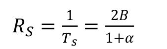
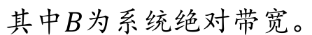
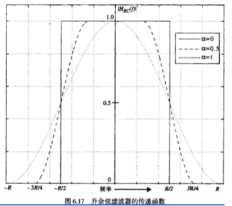
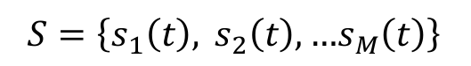
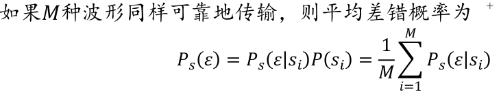

# 第六章 无线移动通信调制

## 脉冲成形

- 脉冲成形：每个基带信号都有其脉冲波形，选择合适的波形，可以**消除特定采样频率的码间串扰**

- 零码间串扰条件(**奈奎斯特准则**)：在接收机每个抽样时刻，通信系统只对当前的符号有响应，而对其他符号的响应均为零

  

  基带信号的带宽取码元各波形带宽的最大值，即考虑波形带宽就是考虑信号带宽。

  由于无码间串扰传输的目的不是需要接收端完全无码间串扰（无拖尾/无码间串扰/波形为方波/波形频谱为Sa函数/信号带宽=码元速率），只是需要在特定采样频率下消除其他码元的干扰（允许拖尾/波形为类似Sa函数的过零脉冲）以减少抽样判决产生的错误，所以信号带宽降低，低于码元速率亦可，从而提高频谱利用率。

  思维误区：脉冲成形不是要恢复波形，且采样速率一直等于码元速率，所以脉冲成形并不是从采样速率角度考虑的，其目的是减少信号带宽并降低码间串扰，是从信号带宽角度考虑的。

- 波形带宽

  - 升余弦滚降滤波器

    - 信号带宽
      $$
      B=\frac{R_S}{2}\left( 1+\alpha \right)
      $$
      其中α是滚降因子，当α=0，即极限情况波形频谱为矩形，此时信号带宽仅为码元速率RS的一半

      射频系统的话，频谱搬移后，信号带宽要加倍：
      $$
      B=R_S\left( 1+\alpha \right)
      $$

    - 由上可得可通过滤波器的码元速率（注意是只有特定的码元速率才能实现无码间串扰），此处为基带信号

    

    

    

    设计的时候，由目的码元速率，选取合适的滚降因子，设计滚降成形滤波器（采样速率-->信号带宽）

  - 高斯成形滤波器（不满足奈奎斯特准则，压根没有零点，肯定有码间串扰）

## 调制信号的几何表示

- 每个符号可能选取的M种波形

  

- 为将S中的元素映射到向量空间（星座图），选取N个基底（基函数），每个波形si(t)都可以表示为基底的线性组合，同时基函数直接彼此正交，，这样就可以将S中的函数都用向量空间中的点表示。

  - 正交性的意义：这样可以用向量空间的距离平方表示波形的能量，这是因为正交性导致基函数乘积积分为0，则计算能量可以只计算基函数的系数平方和（基函数能量归一化）
  - 波形能量计算：波形能量 = 系数平方和 = 离原点距离的平方

- 差错概率与星座点间距离的关系

  - 平均差错概率

    

  - 

## AWGN信道各调制方式的性能分析

## 平坦衰落信道的性能分析

