[TOC]

# 第七章-均衡、分集和信道编码

## 分集

### 基本概念

- 分集定义: 一种低成本、大幅度改进无线链路性能的技术；利用空间、时间、频率之间的独立性，补偿信道衰落的技术；

- 原理：多个信道多个保障

  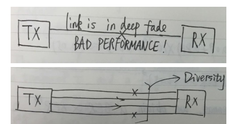

  –利用传播环境中**相互独立（至少是相关性很低）**的信号分量实现；
  –如果一条无线传播路径中的信号经历了深度衰落，那么另一条相对独立的路径中可能包含着较强信号；可以在多径信号分量中选择多个信号，提高接收机的瞬时和平均信噪比。

- 分类

  –根据所处位置，可以分为发送分集和接收分集；
  –根据分集尺度的不同，可以分为微分集和宏分集；
  –根据分集媒介的不同，可以分为空间、时间、频率、极化、角度等多种分集方式；

- 核心原理：使相同信息通过不相关的路径，实现“鸡蛋不放一个篮子”，提高信息安全下车的概率（降低误码率）

### 各类分集原理

- 空间分集

  - 基于相干距离：天线间隔超过λ/4时，相关系数低于0.5；**间隔超过λ/2时，可以认为接收信号完全不相关**；

- 时间分集

  - 基于多径信道时延的时变性，即相干时间，间隔超过相干时间到达的两个信号经历的信道衰落不相关，可能前者深度衰落后者浅度衰落

  - 不相关条件：

    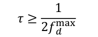

  - 由于时间分集基于信道的时变性，因而对静态信道无效

  - 可以证明，在WSS-US信道（宽平稳不相关散射）中，空间分集和时间分集是等价的

  - 交织：将发送比特顺序打乱，这样可以分散突发错误到不同分组，使同一分组的纠错码更好发挥作用

- 频率分集

  - 基于相干带宽，在不同频段上传相同信息

- 极化分集

  - 基于信号（电磁波）在不同极化方向上的非相关性，这是由于不同极化方向的反射系数在幅度和相位上的差异

### 信号合并

合并技术：将分集接收中，具有不相关性的信号进行合并，提高接收信号接收质量的方法

合并的衡量指标为信噪比或误码率

- 选择性分集

  - 思路：选一条最好的分集支路（信道）

  - 性能分析

    - 各信道平均功率

      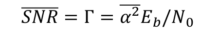

    - 各支路中断概率，门限为γ

      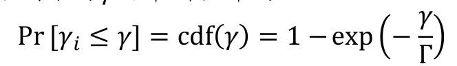

    - 性能分析——M条分集支路至少一条支路未中断的概率
      $$
      P_r\left[ \gamma _选>\gamma \right] =1-\left\{ P_r\left[ \gamma _i\le \gamma \right] \right\} ^M
      $$

      $$
      \text{当}\frac{\gamma}{\Gamma}\text{较小}\left( \text{中断门限比较宽松} \right) \text{可近似认为：}
      $$
      $$
      P_r\left[ \gamma _i\le \gamma \right] =1-\exp \left( -\frac{\gamma}{\Gamma} \right) \approx \frac{\gamma}{\Gamma}
      $$
      $$
      P_r\left[ \gamma _选>\gamma \right] =1-\left\{ P_r\left[ \gamma _i\le \gamma \right] \right\} ^M\approx 1-\left( \frac{\gamma}{\Gamma} \right) ^M
      $$

- 合并式分集 

  - 思路：把每条支路都利用起来，平均信噪比肯定不低，按合理比例加权更是能使得信号质量最佳

  - 前提：M条天线收到的信号分量经历了**独立**的信道传播

  - 最大比率合并——性能最优

    - 合并方法：根据各信道的相对衰落情况h，调整各分集的权重w,权重复向量w = kh *(h为信号衰落复向量的共轭)——幅度加权，相位补偿

      > MRC（最大比率合并）在每一个天线支路上，采用了基于幅度加权、相位补偿的处理方式，能够最大程度地弥补由信道衰落引起的信噪比下降

    - 性能分析

      输出信噪比：最大比合并的输出信噪比为各条分集支路的信噪比之和

      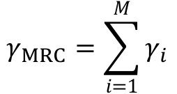

      ​	其输出平均信噪比（独立同分布时）应为：

      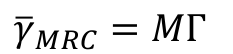

      合并后的信噪比概率分布有点复杂

      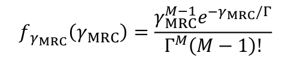

      平均误码率（在信噪比轴上积分）——以BPSK为例

      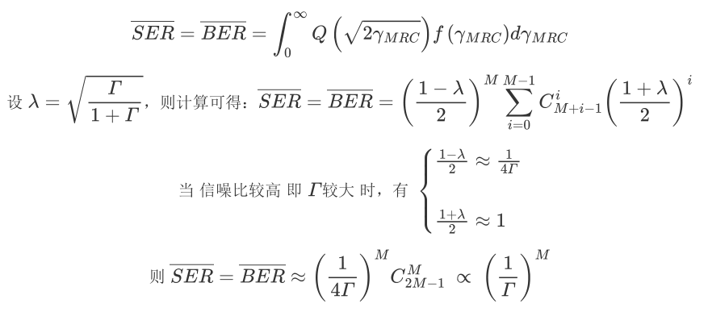

      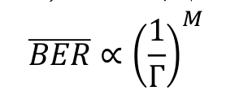

  - 等增益合并

    在等增益合并分集中，对每条支路采用相位补偿，但不对信号幅度进行加权

    - 平均信噪比

  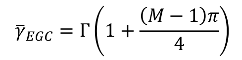

- **系统性能：最大比>等增益>选择**

## 均衡

均衡定义：广义上讲，任意用于削弱符号间干扰（码间串扰）的信号处理操作都可以被称为均衡

###  均衡原理

- 频域均衡：

  从频域角度满足无失真传输条件：信号各频率分量的幅度衰落趋于一致，相位变化趋于线性，早期用于固网、有线传输网络中，但由于模拟电路实现较为困难，转往时域均衡设计

- 时域均衡：针对传输信道的时延色散，基于滤波器结构的均衡器通过调整系数，削弱采样时刻的符号间干扰

  - 原理是：

    将接收信号在时域上卷积上一个函数，这个函数由信道响应决定，表现为横向抽头滤波器

    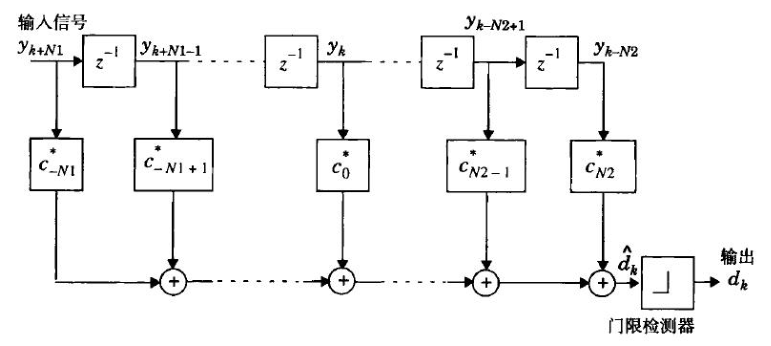

    或者在频域上乘以滤波函数，利用FFT和IFFT，算法复杂度可从O（L^2）降为O(Llog2L),L为时域抽头个数

    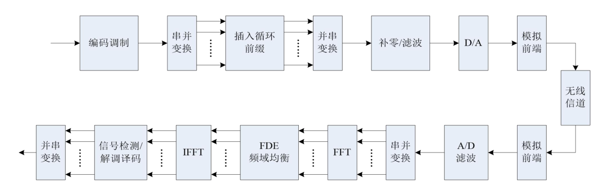

### 自适应均衡器

- 信道估计 + 滤波

  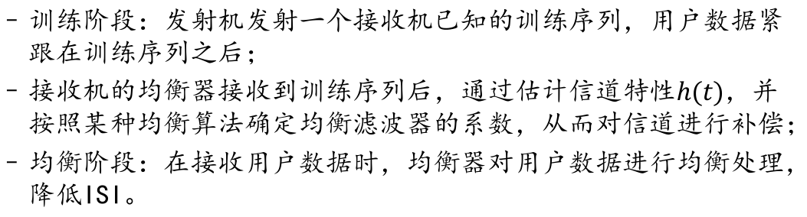

- 均衡器分类

  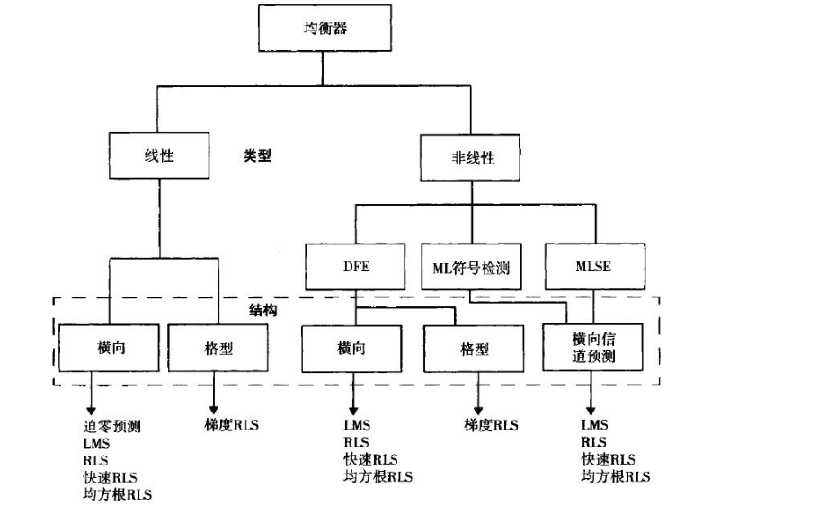

- 线性均衡器

  - 迫零均衡器
    - 思路：调整抽头系数，将期望脉冲的前后K个采样值为0（对前后K个码无串扰）
    - 迫零均衡器在高SNR、静态信道中表现较好，在无线信道中性能一般，因为会放大深度衰落
    - 实现方法：单脉冲训练，调整抽头系数
  - MMSE均衡器（最小均方误差）
    - 原理：调整抽头系数，使得均衡器输出与发送信号之间的均方误差最小
    - 优势：由于不像迫零均衡器期望消除ISI，因此频域输出并不完全平坦，**对噪声放大要小**于迫零算法
    - MMSE均衡器是无线通信系统中常用的线性均衡器
    - 实现方法：单脉冲训练，调整抽头系数

- 非线性均衡器

  - 当信道**失真过于严重时**，线性均衡器会对深衰落及附近的频谱产生很大的增益，从而放大噪声。此时**往往采用非线性均衡器**

  -  最大似然序列检测（MLSE）

    均衡的性能**最优**，但复杂度随着时延扩展呈指数增长，往往被用来作为**性能上界**

  - 判决反馈均衡（DFE）

    常用，但DFE在低信噪比条件下，存在**误差传递（**error propagation）的问题；

    在深度衰落时，DFE的最小均方误差要小于线性均衡器

    - 原理：如果当前判决结果是正确的，则反馈滤波器就能消除由当前码元所造成的的ISI
    - 局限性：一旦判决错误，后向反馈中存在反馈误差，此时减掉的ISI并非真实ISI，从而导致**误码传播**

