[TOC]

# 第八章—MIMO多入多出系统

## 基础知识

- 定义：MIMO系统一般指收发双方都有多个天线阵元时的系统

  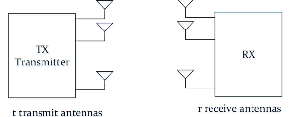

- 优化原理：空分复用、分集、波束成形

  > MIMO只是一个多入多出系统，提供了大量数据链路（信道），那么利用这些信道，可以提高信道容量（空分复用），也可以降低误码率提高信道可靠性（分集）、也可以提升覆盖范围（波束成形——不同用户对应指向性的发射链路，降低干扰）

  - 空分复用：收-发天线间存在有大量的信道链路，系统允许在多条数据链路上实现**并行传输**，从而提高传输速率
  - 分集：见上一章，主要从接收器角度
  - 波束成形：略

- 基于空分复用的信道容量

  - 单信道容量（频谱效率）：

    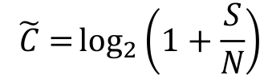

  - N独立信道容量（N为MIMO发送天线接收天线较小数）：

    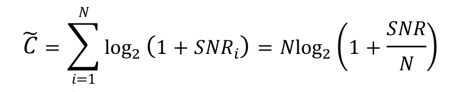

    其中SNR/N是因为要在总信号功率一致的情况下相比较

    不过在低信噪比情况下，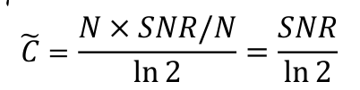，与单信道相当

    所以更适合高信噪比时空分复用，低信噪比时MIMO可用于分集降低误码率

## MIMO模型

- 图例：r个接收天线、t个发送天线

  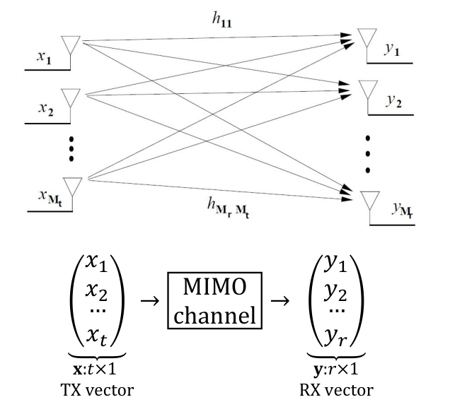

- 数学模型：

  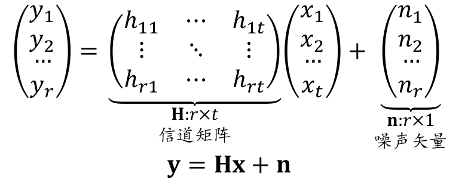

  > r×t的MIMO系统意味着r根接收天线，t根发送天线，前面的系数是接收后者是发送

- 模型解读：

  - 一共存在t × r条信道链路。其中ℎij为TX天线i和RX天线j之间的信道系数，假定为准静态、平坦衰落

    > 瑞利信道，信道假定时不变

  - 每个接收天线的接收信号为所有发送天线的发送信号的叠加

  - 噪声为空-时白噪声：在空间/时间上都不相关

## MIMO接收机

- 模型原理：

  - 由MIMO系统模型：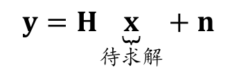，目的是要求解发送向量 x 
  - 线性接收机：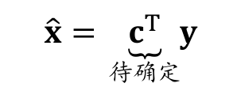，线性接收机需要根据接收向量估测发送向量，其系数矩阵c为需要调整的目标

- ZF接收机：

  - 原理：最小二乘原则

    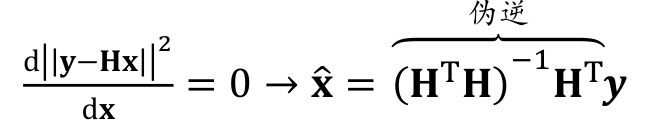

    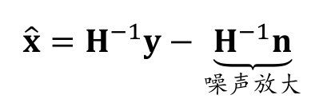

    > 这种方法确实还原出了发送信号x（H-1y）,但也放大了噪声

  - 误码率

    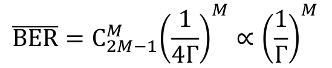

    > 这是因为ZF接收机相当于接收端采用M = r - t + 1根天线，采用最大比率合并MRC的接收分集系统
    >
    > 相当于用t-1个方程判断是哪个发送信号，再用剩下的方程来作为MRC依据（r-t+1）
    >
    > 要深入了解这个原理，可能要结合信道矩阵分解来看

- LMMSE(最小均方误差接收)

  - 原理：	

    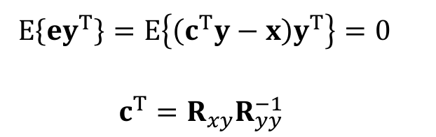

    > 此处是根据误差与接收信号正交的原理推导的

  - 估测结果

    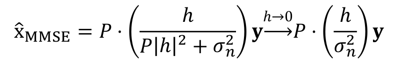

    > 其中P为发送功率，可见**LMMSE接收机不存在噪声放大的问题**

  

## MIMO信道并行分解

信道矩阵分解

- 预置知识：矩阵的奇异值分解

  - 结论：任意的矩阵都存在SVD分解，分解成酉矩阵 * 对角阵 * 酉矩阵

    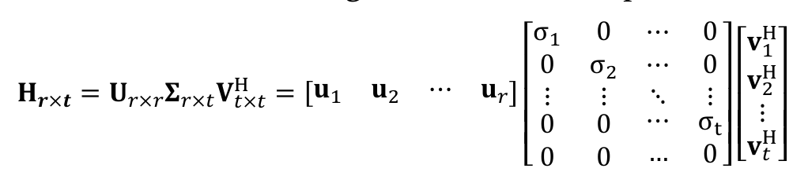

  - 酉矩阵U V

    行向量/列向量均为单位正交向量---->酉矩阵乘以自身的共轭转置得单位阵

    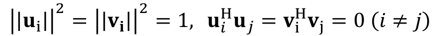

  - 分解步骤

    - 1.由已知待分解矩阵H，求H*H的奇异值，构成对角阵$\Sigma$
    - 2.由奇异值求H*H的单位特征向量（非正交需施密特正交），单位特征向量构成酉矩阵V
    - 3.由公式U1 = HV$\Sigma^{-1}$,再添加正交单位向量构成酉矩阵U

- 分解的通信意义：

  - 可将MIMO模型变为：

    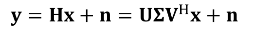

  - 其中发射端预编码：

    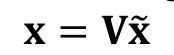

  - 则接收端对接收信号左乘U*可以得到：

    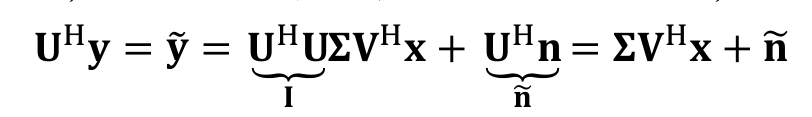

    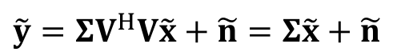

  - 这表明：只要发射和接受方对信道估计好（在静态信道中H时不变），则可以通过发送方预编码，接收方接收成形的方法来使得接收天线接收信号与发送天线信号一一对应（信道解耦），完成 t 路数据并行传输。

  - 同时，噪声功率也没有变化

    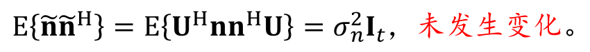

## 基于注水算法的发射功率分配

- MIMO系统容量——从功率分配角度提升信道容量

  > 前面空分复用考虑信道容量并未考虑子信道的衰落差异，只是对比单信道情况做性能分析
  >
  > 此处是在空分复用的基础上，通过发射功率分配进一步提高信道容量

  - MIMO频谱效率

    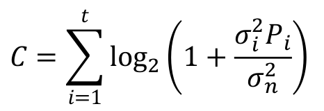

    > 这表明对各个信道链路的功率分配会影响频谱效率（信道容量）

- 注水算法

  - 问题模型

    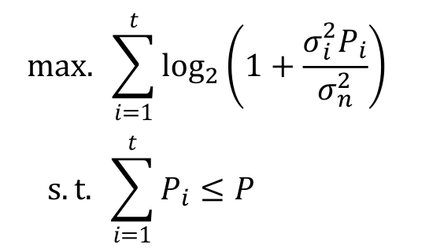

    > 其中$\sigma_i$为信道矩阵分解后的奇异值

  - 利用拉格朗日乘子法

    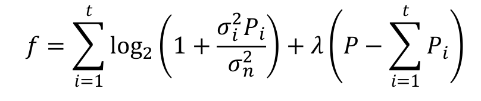

    求导可得

    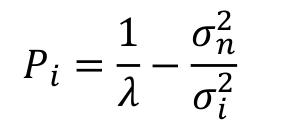

  - 则可利用注水算法

    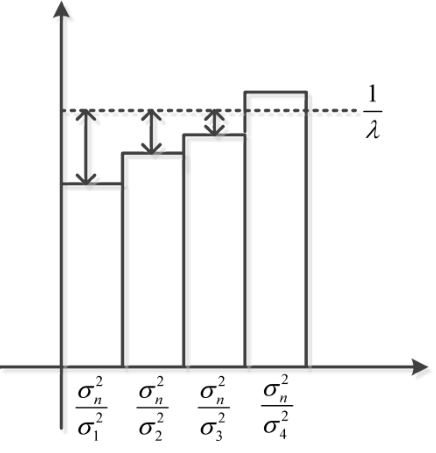

    其中注水面为：
    $$
    \frac{1}{\lambda}=\frac{P+\sum_{i=1}^t{\frac{\sigma _n^2}{\sigma _i^2}}}{t}
    $$
    功率分配为：

    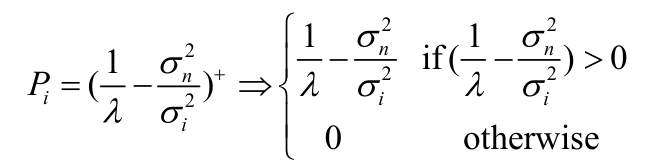

    > 这表明：信道越差，就分配的功率越少或直接不分配，信道越好，功率分配得越多