# 第九章—多载波调制和OFDM

## 多载波调制

- 动机与原理：

  由于信道**相干带宽和码间串扰**，高速信号（带宽大）的容易引入码间串扰或频率选择性衰落，利用**频分复用**思路，将数据调制到多个子载波上**并行传输**，则可以在**不改变系统数据速率**的情况下，每个子载波占用带宽大大减小（码元周期大大增大，变成低速信号），也就大大减小了码间串扰的可能。

- 模拟多载波调制——传统、频谱不重叠

  - 发射框图

    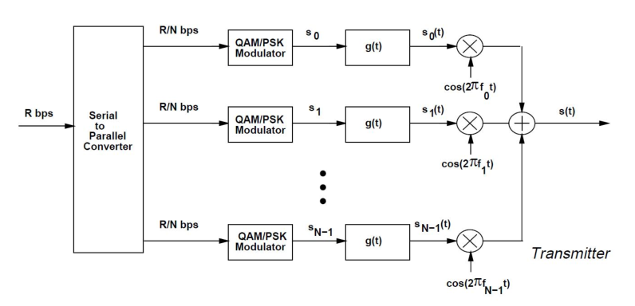

  - 接收框图

    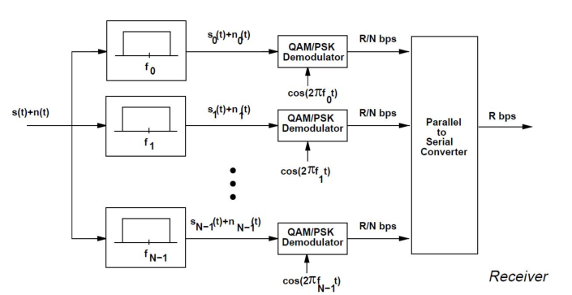

  - 频谱分配

    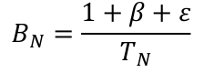

    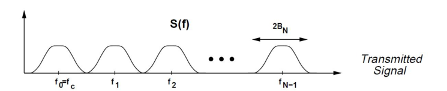

    也就是说每个子载波带宽 比B/N要展宽一些（除了滚降系数，还有额外带宽（保护间隔）$\epsilon$）

  - 缺点：需要频率保护间隔，浪费频谱资源

- 模拟多载波调制——OFDM—频谱重叠，不浪费资源

  - 正交性

    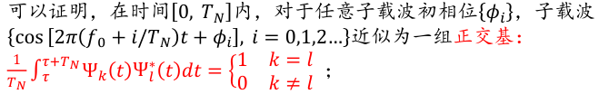

    > 这里利用子载波间的正交性来消除ICI，即子信道之间的干扰，注意正交性指的是在同一周期内基函数（不同子载波）乘积积分为0，也就是可以用相关接收来消除ICI

  - 子载波最小的频率间隔为Δf = 1/TN，也就是说可以不用考虑滚降带来的展宽

  - 频谱分配

    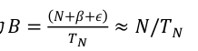

    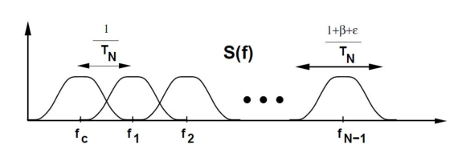

  - 优势

    1.子载频之间不需要保护间隔，能够充分利用频带。相比较单载波调制方法，频谱效率可以近似提升一倍；

    2. 不同子载波上可以采用不同的调制方式，灵活性大
    3. 通过将高速数据流分成多个并行低速子数据流 ，增大了符号持续时间，抗ISI能力增强

  - 接收机：由于利用子载波间的正交性，所以接收机必须采取以下相关接收的形式

    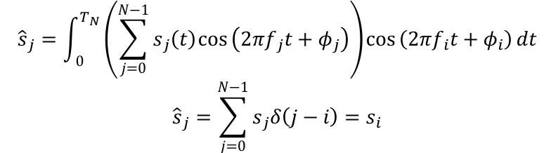

    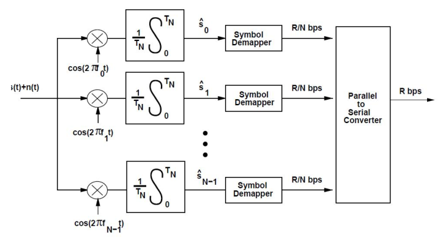

  - 代价：

    - 正交子载波容易受到定时偏差、频率偏差和多普勒频移的影响，处理不好会大大降低系统性能。——较小的频偏就会导致较大的子载波间干扰ICI
    - OFDM有较大的峰均功率比

## OFDM的数字实现——数字多载波调制

- 模拟多载波调制的局限性：

  - 发射机需要N个上变频器，接收机需要N个下变频器

  - 系统复杂度非常高，实现难度大

    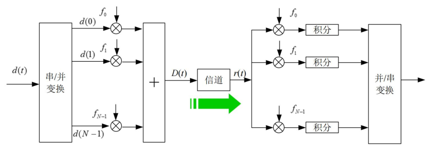

  > 但是利用FFT和IFFT在频域上变换，则能将变频器从N对缩减为一对，这大大降低了系统的复杂度

- 数字多载波调制—数学基础

  - 循环矩阵

    –循环矩阵是方阵；
    –任意循环矩阵可以被傅里叶变换矩阵对角化。

  - DFT的矩阵表示

    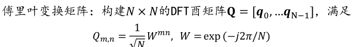

    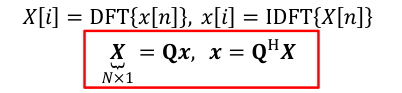

  - DFT的对角化

    

    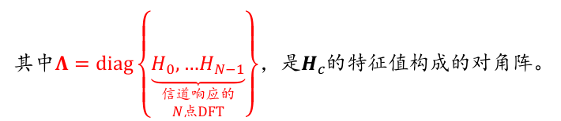

    > 此处的证明思路如下：利用循环矩阵，以及特征向量为

- 数字多载波调制—系统模型

  - 那利用对角化，可以通过预编码（IDFT）和接收成形（FFT），可以将系统转化为

  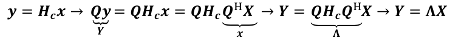

  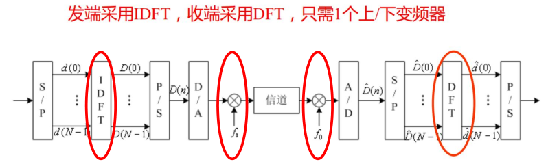

  - 保护间隔

    - 全零保护间隔

      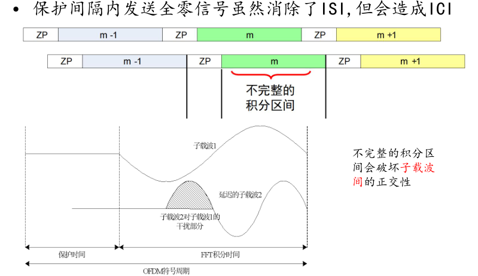

    - 循环前缀

      为了减小ICI，OFDM符号可以在保护时间内发送循环扩展信号，循环前缀是将OFDM符号尾部的信号搬移到头部构成

      这样可以保证有时延的OFDM信号在FFT积分周期内总是具有整倍数周期

  - 系统设计

    - 参数设计

      - 相关带宽—>N，确保子载波带宽远小于相干带宽，消除码间串扰
      - 相关时间—>TN，确保OFDM符号周期（N+CP）Ts远小于相干时间，确保码元能正确接收
      - 循环前缀—>CP,进一步消除码间串扰，由最大时延拓展决定，也就是CP个Ts要大于最大时延拓展
      - 子载波个数N—>取2的幂次，同时满足条件1、2的最大N值

    - 发射机

      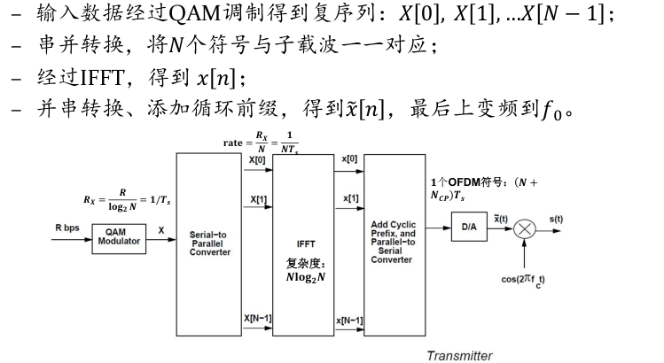

    - 接收机

      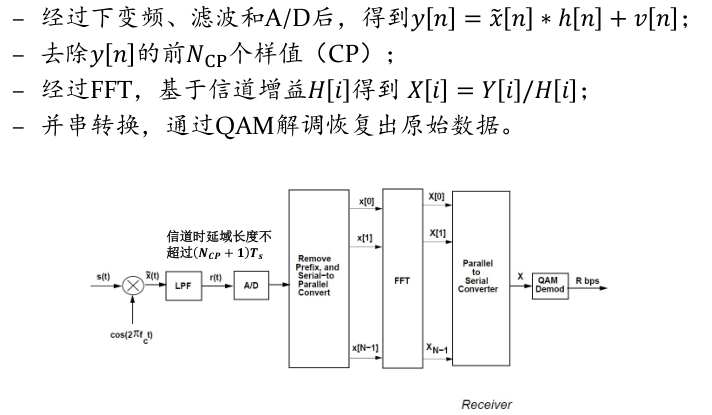

  - 性能评估

    - 循环前缀开销：

    - 数据速率：

    - 峰均功率比：

      当OFDM子载波数为N时，最大峰均功率比为N（相当于N个子载波峰值同时叠加）

      实际峰均功率比小于N，但也随着子载波数以近似线性的方式增大

    - 频率偏移

      - 频率偏移量

        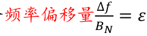

      - 信干噪比

        - 信号功率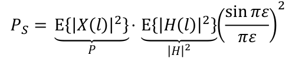
        - 干扰功率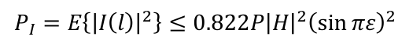

        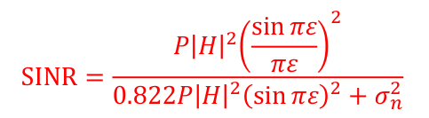

        > 其中P为信号发射功率，|H|平方为信道增益，当理想情况（频率偏移为0），SINR就为接收信号功率/噪声功率（无ICI干扰）

        

​	

