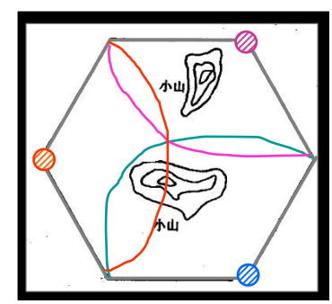

# 第三章-无线蜂窝系统

## 蜂窝网络概述

1. 大区制的存在问题（蜂窝由来）：大区制移动通信网无法适应飞速发展的通信需求（用户数越多对单个基站的带宽要求越夸张），覆盖范围受地球曲度限制，同时受限于移动终端的发送功率，上行信号传输距离也有限。
2. 于是将大区分为若干小区，并呈蜂窝状排布，这样既能充分覆盖空间，又能利用频分复用减少邻区干扰，每个小区的带宽要求也能实现，复用频谱能极大提高频资源利用率。
3. 对于同样大小的服务区域，采用正六边形构 成小区所需的小区数最少，无重叠区（理论上），故所需 的频率组数也最少，最经济。

## 频率复用和小区制通信系统

1. 小区制网络构成基本概念

   1. 大区划分为若干小区（大区为簇），发射机功率相应减小
   2. 同一簇用相同频段，同一簇内小区间分配不同信道，或者说相邻小区不能使用同一频段

2. 分类1：条形、**面状**

   1. 圆形、三角形、正方形、**六边形**
   2. 重叠区：大了干扰大，小了中间弱
   3. 对于同样大小的服务区域，采用正六边形构成小区所需的小区数最少，无重叠区（理论上），故所需的频率组数也最少，最经济。仅有理论分析和设计意义。

3. 分类2：激励方式

   

   1. 中心激励
   2. 顶点激励：避免辐射阴影

4. 频率复用

   1. N个相邻小区——簇

   2. 簇内使用不同子频段

   3. 相邻簇使用相同频段

   4. 形成簇的条件——**小区数N必须满足的公式**

      1. 相邻簇，同频小区距离相等且最大

      2. 能彼此邻接且无空隙覆盖整个面积
         $$N=(i^2 + ij + j^2)$$

   $$
   i，j为相邻同频小区的二维距离，为非负整数
   $$

   图例中，i=3,j =2,N=19

   

5. 系统容量 = 系统可以容纳的用户数

   1. 当N越小，说明复用程度越高，系统容量越大，频率利用率越高

   2. 频率复用因子N

   3. 系统容量
      $$
      C=MS=MkN,
      $$
      $$
      其中S=kN意为簇内信道的复用程度，
      $$
      $$
      M为簇在系统中的复用次数
      $$

   4. 矛盾：同频干扰和频谱利用率

      1. N越小，同频小区越近，同频干扰越大，但复用次数多，系统容量大
      2. N越大，同频小区越远，同频干扰越小，但复用次数少，系统容量小

## 信道分配策略（本章重点）

### 切换策略

1. 切换：当一个移动台在通话过程中，从一个基站移动到另一个基站时，MSC自动地将呼叫转移到新的信道上；

   切换请求**优于**呼叫初始请求

2. 切换相关参数

   1. MS最小可用信号功率$P_{r,\min}$
   2. 切换启动强度$P_{r,HO}$——可调参数
   3. $\bigtriangleup \ =\ P_{r,HO}-P_{r,\min}$
      1. ▲过大，则可能来不及切换则通信中断
      2. ▲过小，则可能切换过于频繁

### 干扰与系统容量

1. 干扰：

   – 噪声——内部噪声（热噪声），人为噪声
   – 同小区中的其它移动台
   – 相邻小区的通话
   – 使用相同频率的其它基站
   – 其它非蜂窝系统干扰

2. 系统容量
   $$
   C=MkN=MS
   $$
   $$
   M\text{为系统中信道复用次数}
   $$
   $$
   k\text{为每个小区分配的信道数}
   $$
   $$
   N\text{为簇内的小区数}
   $$
   $$
   S\text{为系统可用的双向信道数}
   $$

3. **同频干扰**：指所有落到接收机**通带内**、与有用信号频率相
   同或相近的无用信号所产生的干扰——蜂窝系统主要干扰因素

   1. **同频复用比Q**
      $$
      Q\ =\ \frac{D}{R}=\sqrt{3N}
      $$

      $$
      D\text{为同频小区距离，}R\text{为小区半径}
      $$

   2. 矛盾：同频干扰和频谱利用率

      1. N越小，同频小区越近，同频干扰越大，但复用次数多，系统容量大（Q越小，即同频小区越近）
      2. N越大，同频小区越远，同频干扰越小，但复用次数少，系统容量小

   3. 信干比$\frac{S}{I}$
      $$
      \text{平均接收功率}P_r=P_0\left( \frac{d}{d_0} \right) ^n,\text{其中}n\text{为路径衰减指数}
      $$
      $$
      \text{则当}D\text{相对}R\text{较大，做如下近似：}
      $$
      $$
      \frac{S}{I}=\frac{R^{-n}}{\Sigma _0^{i_0}D^{-n}}=\frac{\left( \sqrt{3N} \right) ^n}{i_0}
      $$
      $$
      \text{其中}i_0\text{为第一层同频干扰小区，典型值取}6\left( \text{一般都是}6 \right)
      $$

### 信道规划

1. 控制信道和话音信道
2. 一个小区仅需一个控制信道
3. 信道双向，单向带宽需乘以2

### 本章出现的通信系统

1. GSM系统
2. AMPS

## 中继与服务等级

1. 中继：大量用户共享相对少的信道时，中继系统为每个用户按需分配信道

2. 服务等级（GOS）：中继系统**最忙碌时**，用户进入系统的能力，用呼叫阻塞概率/呼叫延迟一段时间的概率描述

3. 两种策略：

   1. 呼叫阻塞清除（LCC）：不提供排队——阻塞概率
   2. 呼叫阻塞延迟（LCD）：放入队列，排队等候空闲信道——延迟一定时间的概率

4. 一对矛盾：话务量 <-->呼损率（呼叫阻塞概率）

   1. **话务量强度A**：单位小时的呼叫时长（单位Erlang）

      （描述信道的时间利用率，单个信道的话务量强度应介于01之间。）
      $$
      A_u=\lambda H
      $$
      $$
      \text{其中}\lambda \text{为单位时间呼叫次数，}H\text{为平均呼叫时长}
      $$
      $$
      \text{所得为每个用户话务量强度}
      $$
      $$
      A=UA_u,\text{为系统总话务量}\left( \text{强度} \right)
      $$

   2. **呼损率B**：最繁忙时，呼叫损失概率
      $$
      ErlangB\text{公式:}
      $$
      

      实际还是查表

      其中C是中继系统信道数，B是呼损率，A是话务总量。

      知其二求一

## 提高系统容量的方法

$$
\text{系统容量受限的原因}——\frac{S}{I}=\frac{\left( \sqrt{3N} \right) ^n}{i_0}
$$

1. 小区分裂
   $$
   \text{信道复用指数}Q=\frac{D}{R}=\sqrt{3N}
   $$
   $$
   \text{小区分裂则是将簇等比缩小，}
   $$
   $$
   \text{保证}Q\text{不变的情况下，增加簇的数量}
   $$
   $$
   \text{从而增加信道复用次数，增大系统容量}
   $$

   $$
   \text{注意：小区分裂后要保证小区边界的接受功率相同}
   $$
   $$
   \text{为此需要降低基站功率为}\left( \frac{P_{t0}}{a} \right) ^n
   $$

   代价：更多的基站，更多的切换操作…

2. 扇区划分
   $$
   \text{扇区划分保证小区大小不变（}R\text{不变），}
   $$
   $$
   \text{通过提高信干比}\frac{S}{I}\text{的方法提高信道复用因子}1/N
   $$
   $$
   i_0典型取值为6（全向天线），2（120扇区），1（60扇区）
   $$

   $$
   \text{举例：划分3个120°扇区，则每个扇区的信干比变为原来的3倍}
   $$
   $$
   \text{则将}N\text{降低可保持扇区内信干比不变}
   $$
   $$
   \text{从而提高了复用因子1/}N
   $$
   $$
   3\frac{\left( \sqrt{3\frac{N}{3}} \right) ^n}{2}>\frac{\left( \sqrt{3N} \right) ^n}{6}
   $$

   代价：

   增加每个基站上的天线数目；
    扇区划分降低了中继效率（将大的信道池转换成了多
   个小组）

3. 微小区

   方法：大功率中心基站由小区边缘的低功率发射器代替。

   原理：由于发射功率降低，只覆盖单个区域，因此同频干扰也降
   低了很多，因此可以提高复用因子；

   图例：不足：需要多个低功率发射器，且基站复杂度提高。
