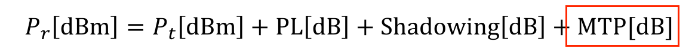
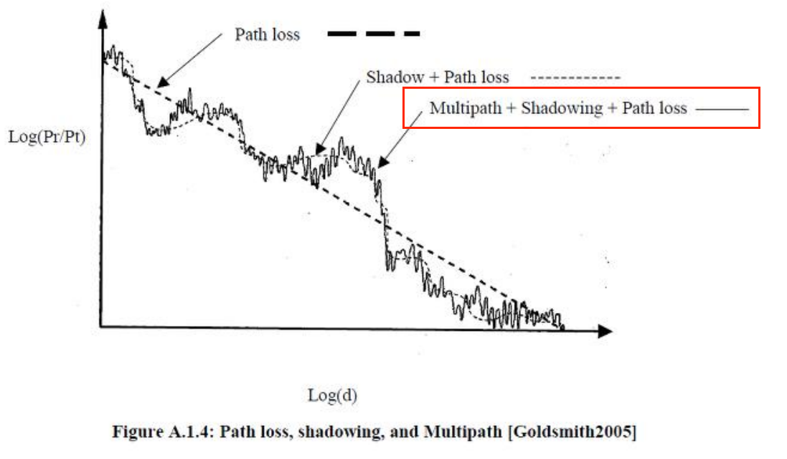
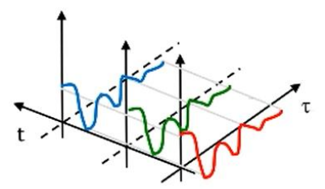
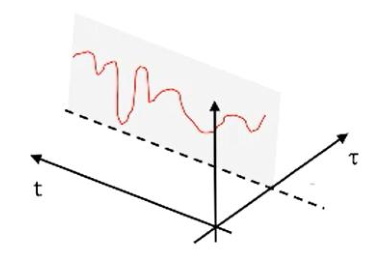
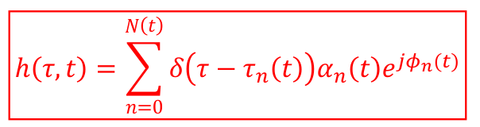
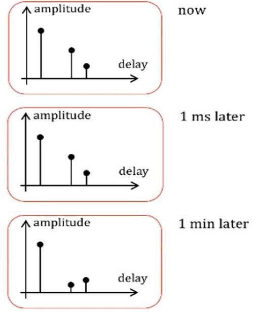
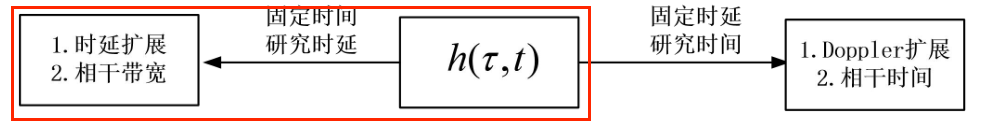
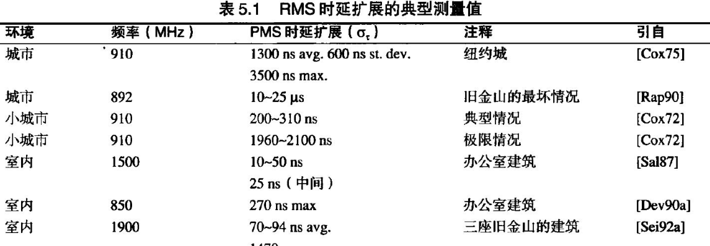
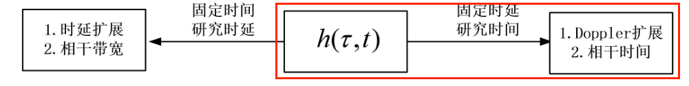

# 第五章-小尺度衰落和多径效应

## 小尺度衰落模型

## 小尺度衰落的因素

### 多径效应

- 原因及表现：信号通过不同的方向和路径传输，会经历不同的**时延**、**衰减**、**相移**（时延和反射相位损失等），导致**不同多径分量**的幅度、相位**时变随机**分布。

  所有多径分量**合成**后成为了接收信号，固定时间（相干时间内或静态信道）不同时延导致了接收信号时间上的色散（码间串扰——相关带宽）；

  

  固定时延（单径信道）的时变信道，则导致接收信号的频率色散（多普勒频移频谱展宽，在时域上表现为相干时间）

  

- 模型：时变冲激响应belike

  

  - 其中n=0为LOS(视距/直达径)，其他为多径分量
  - 冲激函数——时变传播时延，不同多径的T-R距离时变
  - 幅度增益——时变多径信道增益，不同多径信道的障碍物、反射、绕射、T-R距离等时变因素
  - 相位旋转——时变多径相位旋转，信道的多普勒偏移和传播延迟共同决定

- –时变特性：收发信机、环境的空间运动；
- –滤波特性：以任一时刻 t 到达的多径信号为基础，其幅度和时延联合影响信道的滤波特性——相关带宽。

### 多普勒效应

## 小尺度衰落的参数

### 时延拓展与相关带宽

- 定性分析：

  无线通信需要将速率为$R_B$的基带信号调制到带通载波上，那么假如因为多径效应造成的时延拓展$\sigma_\tau$超出了码元周期$T_s$，就会造成严重的码间串扰，这就需要时域均衡器来减小码间串扰。

  换个角度思考，时延拓展的倒数就是表示：在一定频率间隔内的不同频率分量有很强的幅度相关性（频域上表明信道对与所有信号频率分量来说都是平坦的；时域上表明码间串扰小，不同分量合成时，基带信号都是同一个码元），这也就定义了相关带宽，表明在这个频率间隔内的话，不同的频率分量有相近的增益（频率一致性）。当然，相关带宽正好与基带信号带宽相近也会带来很大码间串扰（时延与码元周期相近），所以在定义相关带宽时，根据需要的频率相关性调整相关带宽

- 定量分析

  - **rms时延拓展$\sigma_{\tau}$**
    $$
    \sigma _{\tau}=\sqrt{\bar{\tau^{2}}-\bar{\tau}^2}
    $$
    为什么不用平均时延$\bar{\tau}$？

    ​	因为信号都是以同一个时延到达的话，就是说接收信号没有时间上的弥散，也就没有码间串扰，要产生码间串扰就应该考虑的是“时延的最大差值”——所以用时延的标准差来考量非常合理。
    
    时延拓展典型值：室内ns级，室外ms级
    
    
    
  - **相关带宽Bc**
  
    根据不同的频率相关性要求，选择合适的相关带宽
    $$
    B_c=\left\{ \begin{array}{l}
    	\frac{1}{5\sigma _{\tau}}\ \text{，}\rho >0.9\\
    	\frac{1}{50\sigma _{\tau}},\ \rho >0.5\\
    \end{array} \right.
    $$

### 多普勒拓展与相关时间

- 定性分析：同样考虑基带信号的稳定传输，要求信号在一个码元周期内增益稳定（不能有剧烈衰落，当然也不能因为时延拓展产生明显的码间串扰），当考虑信号的时变增益在一个码元周期内稳定时（此时固定各路时延），也就是信道增益在一定时间范围内具有强幅度相关性（时间一致性），也就是相关时间。

  换个角度思考，相关时间的来源其实就是信道环境中的物体**运动**、接收终端的**运动**，各路径的**入射角度不同**，使得各径分量信号产生了多普勒频移，不同频率分量叠加，产生了时变增益（与多普勒频移的倒数正相关）。以两路多普勒频移信号为例，其多普勒数学表达为：
  $$
  \text{假设两路信号都产生频偏，但频移差为|}f_1-f_2|,\text{其叠加信号为：}
  $$
  $$
  r\left( t \right) =a_1\cos \left( 2\pi f_1t+\phi _1 \right) +a_2\cos \left( 2\pi f_2t+\phi _2 \right) 
  $$
  $$
  =a\cos \left( |\pi f_1-f_2t+\frac{\phi _1-\phi _2}{2}| \right) \cos \left( \pi \left( f_1+f_2 \right) t+\frac{\phi _1+\phi _2}{2} \right)
  $$

  $$
   \text{此处为了简便分析，使得}a_1=a_2
  $$

  可见信道增益会在1/|f1-f2|时间范围内剧烈变化，为了方便设计信道符号速率，取相对小的值为相关时间，认为信道增益在此时间范围内相对稳定。

- 定量分析：

  - 多普勒频移
  - 多普勒拓展
  - 相干时间

## 小尺度衰落类型

## 瑞利与莱斯分布

## 多径衰落信道统计模型

